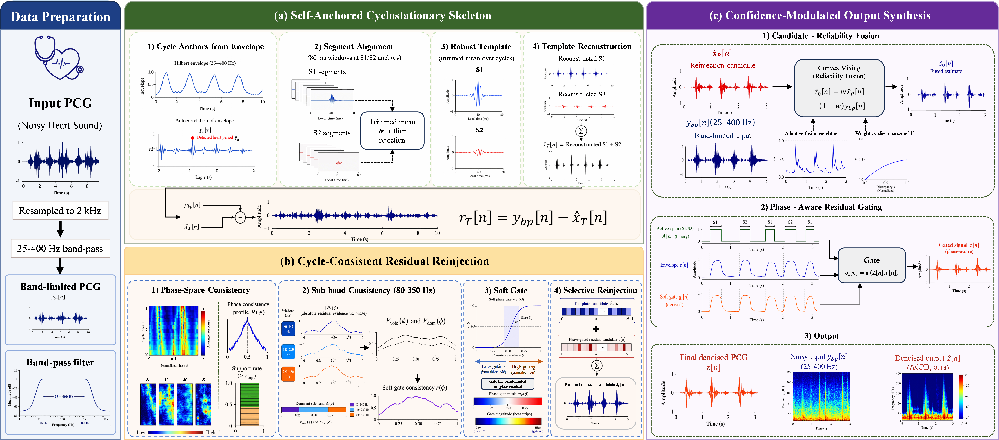
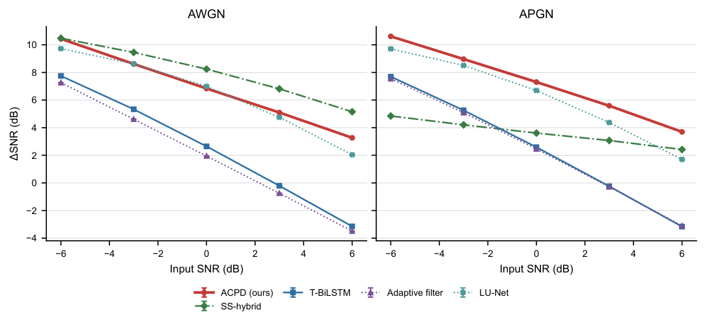
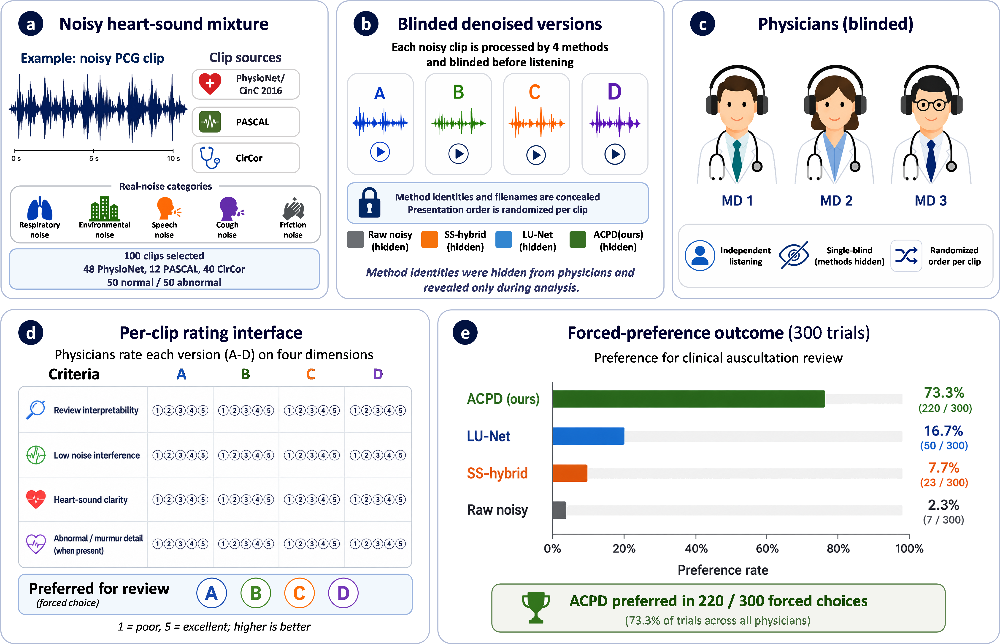

<h1 align="center">
  Adaptive Cycle-Prior Denoising of Heart Sound Signals
</h1>

<p align="center">
  <strong>Boqiu Shen<sup>1</sup></strong>
  &nbsp;·&nbsp;
  <strong>Xinxin Zhang<sup>1</sup></strong>
  &nbsp;·&nbsp;
  <strong>Zerui Li<sup>3</sup></strong>
  &nbsp;·&nbsp;
  <strong>Liudan Zhao<sup>4</sup></strong>
  &nbsp;·&nbsp;
  <strong>Xin Zhou<sup>5</sup></strong>
  &nbsp;·&nbsp;
  <strong>Guangtao Zhai<sup>2</sup></strong>
  &nbsp;·&nbsp;
  <strong>Menghan Hu<sup>1,*</sup></strong>
  &nbsp;·&nbsp;
  <strong>Kun Sun<sup>4,5,*</sup></strong>
</p>

<p align="center">
  <strong><sup>1</sup>East China Normal University</strong> &nbsp;&nbsp;
  <strong><sup>2</sup>Shanghai Jiao Tong University</strong> &nbsp;&nbsp;
  <strong><sup>3</sup>University of Wisconsin–Madison</strong>
  <br>
  <strong><sup>4</sup>Xinhua Hospital, Shanghai Jiao Tong University School of Medicine</strong> &nbsp;&nbsp;
  <strong><sup>5</sup>Engineering Research Center of Techniques and Instruments for Diagnosis and Treatment of Congenital Heart Disease, Ministry of Education</strong>
</p>

<p align="center"><sup>*</sup>Corresponding authors</p>

<p align="center">
  <a href="https://www.python.org/"></a>
  <a href="#"></a>
  <a href="#"></a>
  <a href="https://www.apache.org/licenses/LICENSE-2.0"></a>
  <a href="#"></a>
</p>

<p align="center">
  <b>Denoising heart sounds (phonocardiograms) with an adaptive cardiac-cycle prior.</b>
</p>

<p align="center">
  If you have any questions, please contact
  <strong>Boqiu Shen</strong> (3392937082@qq.com) or
  <strong>Menghan Hu</strong> (mhhu@ce.ecnu.edu.cn).
</p>

---

## ✨ Introduction

<div align="justify">

Heart-sound (PCG) recordings collected outside quiet clinical rooms are routinely corrupted by breathing, speech, friction, and ambient noise, which overlaps the heart-sound band and often masks the low-amplitude detail (murmurs, extra sounds) that clinicians rely on. Classical filters struggle to remove such band-overlapping noise without eroding heart-sound detail, while supervised deep denoisers need clean targets and large labelled corpora and can degrade across acquisition devices.

**Adaptive Cycle-Prior Denoising (ACPD)** is a signal-processing method built on one observation: a heart sound repeats quasi-periodically with the cardiac cycle, whereas exogenous noise does not. ACPD estimates the recording's own cyclic structure and uses it as a prior to separate heart-sound-related content from dispersed noise — **selectively recovering the low-amplitude in-band detail masked under strong noise** instead of treating every non-template component as noise.

</div>

<p align="center">
  
  <br><em>The ACPD pipeline: a self-anchored cyclostationary skeleton, cycle-consistent residual reinjection, and confidence-modulated output synthesis.</em>
</p>

**Highlights**

- ❤️ **Cycle-consistency prior** distinguishes heart-sound residuals from dispersed noise.
- 🔬 **Detail recovery** — restores low-amplitude in-band structure (including murmur-like components) masked under strong noise.
- 🛡️ **Diagnostic-aware** — protects S1/S2-active regions and systolic/diastolic activity.
- 🔁 **Deterministic** — same input produces the same output; no learned weights or training data.

---

## 🧠 Method

<div align="justify">

A noisy recording is resampled and band-pass filtered, then passes through three modules:

**(1) Self-anchored cyclostationary skeleton.** Coarse S1/S2 anchors are estimated from the noisy signal itself, and a conservative main heart-sound skeleton is reconstructed by a cross-cycle trimmed mean.

**(2) Cycle-consistent residual reinjection.** The template residual is mapped into a normalized cardiac-cycle phase space, where phase energy, sign coherence, cross-cycle support, and sub-band consistency gate the backfilling of residuals that recur across cycles.

**(3) Confidence-modulated output synthesis.** A Wiener-type convex combination of the candidate and the band-limited input, followed by a phase-aware gate that protects diagnostically active regions.

If reliable cardiac anchors cannot be found (e.g. severe arrhythmia, very short or very noisy input), ACPD gracefully falls back to the band-limited signal.

</div>

---

## 📦 Datasets

This repository ships **no data**. The method needs only your own `.wav` recordings at inference time. The paper's evaluation uses public PCG datasets (PhysioNet/CinC 2016, PASCAL Archive, CirCor DigiScope 2022, Yaseen2018/OAHS) and external noise sources (ICBHI 2017, DEMAND, ARCA23K). Please obtain each dataset from its **official source** under its own license and cite the original dataset papers; they are **not** redistributed here.

---

## ⚙️ Installation & Usage

```bash
git clone https://github.com/oruan233/ACPD-PCG-Denoising.git
cd ACPD-PCG-Denoising

# Python 3.11 (existing environment)
pip install -e .

# Or create the supplied conda environment first
conda env create -f environment.yml
conda activate acpd
pip install -e .
```

### Choose the algorithm version

The default **data-adaptive version** corresponds to the ACPD row in the JBHI
main objective table. It uses recording-adaptive evidence gates, projected
residual gains and candidate-energy fusion. The historical fixed-parameter
implementation is retained with `--version fixed` or `version="fixed"`.
See [the source trace and version notes](docs/VERSIONS.md).

```bash
# Single file or folder; adaptive is the default
python scripts/denoise.py --input noisy.wav --output denoised.wav
python scripts/denoise.py --input path/to/wavs --output path/to/out_dir

# Historical fixed-parameter version
python scripts/denoise.py --input noisy.wav --output fixed.wav --version fixed

# Verify the release without downloading data
python tests/test_smoke.py
python tests/test_release.py
```

The file/array API converts multichannel input to mono, analyzes at 2 kHz and
returns audio at the input sample rate with the same number of frames.

```python
import soundfile as sf
import acpd

noisy, sr = sf.read("noisy.wav")
denoised, info = acpd.denoise_array(noisy, sr)
sf.write("denoised.wav", denoised, sr)

info = acpd.denoise_file("noisy.wav", "denoised.wav")
fixed, fixed_info = acpd.denoise_array(noisy, sr, version="fixed")
```

### Evaluation and cumulative ablation

```bash
# Start small on your reference recordings
python scripts/evaluate.py --data-root data/reference_wavs --output-dir outputs/synthetic --limit 1

# Real recorded-noise mixtures, using your downloaded noise clips
python scripts/evaluate.py --data-root data/reference_wavs --noise-manifest data/noise_manifests/noise_manifest.csv --noise-categories speech cough --output-dir outputs/real

# Cumulative template / reinjection / fusion / final-gate ablation
python scripts/reproduce_results.py --experiment ablation --data-root data/reference_wavs --output-dir outputs/ablation
```

Outputs include mixture-level metrics, recording-level means, per-dataset and
per-scenario summaries with bootstrap intervals, run settings and error logs.
See [data preparation](docs/DATASETS.md) and
[reproduction instructions](docs/REPRODUCIBILITY.md) for record manifests,
noise manifests, seeds and exact-table requirements.

The complete ACPD method requires NumPy, SciPy, librosa, SoundFile and
PyWavelets, with YAML and plotting support included in the environment.
It needs no deep-learning framework or learned weights. External baseline
training, MATLAB segmentation, raw datasets and physician rating records
are outside this algorithm release.

---

## 📊 Results

<div align="justify">

Denoising performance in the JBHI main table (recording-level means):

</div>

<div align="center">

| Dataset / noise | ΔSNR (dB) ↑ | ΔSI-SDR (dB) ↑ | RMSE ↓ | MAE ↓ |
|---|:---:|:---:|:---:|:---:|
| PhysioNet / synthetic | **7.48** | **6.25** | **0.116** | **0.082** |
| PASCAL / synthetic | **7.79** | **6.69** | **0.108** | **0.067** |
| PhysioNet / real recorded | **6.11** | **4.54** | **0.129** | **0.083** |
| PASCAL / real recorded | **6.58** | **5.15** | **0.118** | **0.066** |

</div>

<p align="center">
  
  <br><em>ΔSNR versus input SNR across methods (synthetic noise).</em>
</p>

<p align="center">
  
  <br><em>Physician subjective listening assessment under real recorded-noise mixtures.</em>
</p>

<div align="justify">

Full per-method comparison against signal-processing and deep baselines, with ablations, is in the paper. These historical results are not recomputed by installation.

</div>

---

## 📝 Citation

If you find this work useful, please cite the paper (details will be finalized upon publication):

```bibtex
@article{shen2026acpd,
  title   = {Adaptive Cycle-Prior Denoising of Heart Sound Signals},
  author  = {Shen, Boqiu and Zhang, Xinxin and Li, Zerui and Zhao, Liudan and Zhou, Xin and Zhai, Guangtao and Hu, Menghan and Sun, Kun},
  journal = {IEEE Journal of Biomedical and Health Informatics},
  year    = {2026},
  note    = {Research manuscript}
}
```

---

## 🙏 Acknowledgements

This work is sponsored by the National Natural Science Foundation of China (No. 62371189). We thank the maintainers of the public PCG and noise datasets used in this work — PhysioNet/CinC 2016, PASCAL Archive, CirCor DigiScope 2022, Yaseen2018/OAHS, ICBHI 2017, DEMAND, and ARCA23K — for making their data publicly available.

---

## 📄 License

This project is released under the [Apache 2.0 License](https://www.apache.org/licenses/LICENSE-2.0). The public datasets referenced above remain under their own licenses and are **not** redistributed here.
